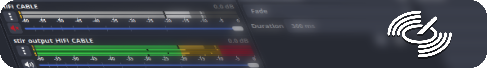

</img>
<h3 align="center">multichannel audio filter tools for OBS</h3>

  
  
  
   
  
  

---

### what is this
*audio filter/upmixer designed for many channels*

STIR aims to be an easy-to-approach solution for virtual upmixing of 2-channel sources and applying filters onto their individual channels.

the primary inspiration for this project comes from VRChat's [ongoing lack of audio filter support](https://feedback.vrchat.com/sdk-bug-reports/p/proposal-for-fixing-audio-filters-eg-low-pass-support-for-avpro), but can be expanded to any valid usage case within OBS.

### usage
*the info, the guide*

refer to the [wiki](https://codeberg.org/mintea/stir/wiki) for setup and usage.

### supported environments
*versions n' stuff*

the minimum version requirement for OBS Studio is **v30.0.0**.
supports Windows (tested via Win10) and Linux (tested via Arch). there are no current plans to support macOS.

### credits
*friends who contributed directly and indirectly to this project*

**Crunchy Joints**, for constantly pushing STIR to its limits, most of the early/ongoing bughunting and testing efforts, and being an incredible second brain to spin up new ideas.

**Llamahat**, for the initial idea of turning this concept into an OBS plugin.
