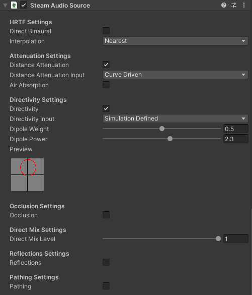

VRChat released their `Steam Audio Beta` branch of the game as they integrate the official [Steam Audio](https://valvesoftware.github.io/steam-audio/) modules over time; STIR is compatible and **it is recommended to configure the Steam Audio components for your project alongside it** - the two are direct beneficiaries of each other and STIR aims to remain compatible going forward

## integration

- grab and import the latest [Unity plugin for Steam Audio](https://valvesoftware.github.io/steam-audio/downloads.html)
> the importable UnityPackage should be within the `/unity/` folder
- locate (or add) an `Audio Source`
- add a `Steam Audio Source` component to it
> it should be noted, as stated above, that VRChat is merging Steam Audio features with the game **over time** and most of the component's features **do not work right now**

from limited testing, we've found `Directivity` and `Attenuation` to function as expected

a red ellipsoid gizmo should appear on the affected `Audio Source` when `Directivity` is enabled

for further configuration info on these parameters, [refer to the official documentation for the component](https://valvesoftware.github.io/steam-audio/doc/unity/source.html)