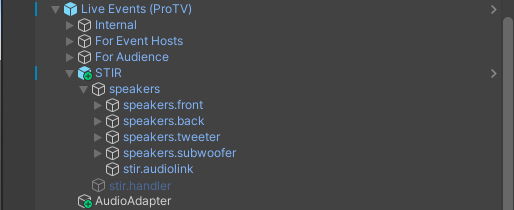

> [!NOTE]
> the latest versions of the preset UnityPackages can be found [here](https://github.com/minteeaa/stir/tree/master/meta/packages)

## usage
using the preset UnityPackage for ProTV is straightforward:

- locate the prefab in `/Assets/mintea/STIR/ProTV`
- drag the STIR prefab into the base hierarchy of the ProTV prefab

STIR should now be available as a ProTV preset mode, selectable from both the hierarchy and from the in-game UI

relocate the speakers, experiment and find a setup that works for you!