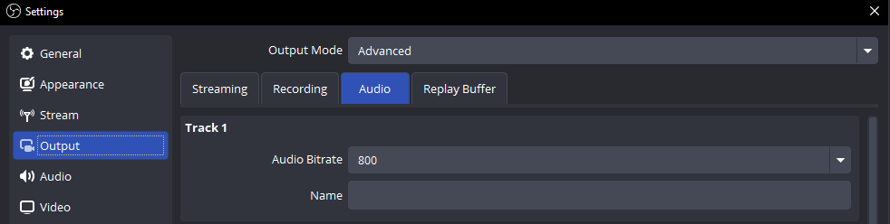
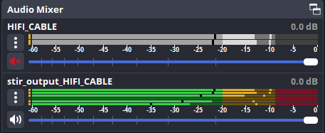

## audio bitrate
you may find the default audio bitrate per track (`320`) sounds compressed in VRChat; set the audio bitrate of the track STIR uses (by default track 1) to something larger (`800` is recommended)

> [!IMPORTANT]  
> when streaming to VRCDN using track bitrates above `320`, do **not** use RTSPT for video players; MPEG-TS is preferred

## sources
it is advised to mute the input source in the Audio Mixer to prevent overlapping input - the source will still output to STIR when muted in OBS

## tracks
by default, the STIR source is set to output audio on `Track 1`; this will be customizable in the future, but for now make sure to double check the track configuration