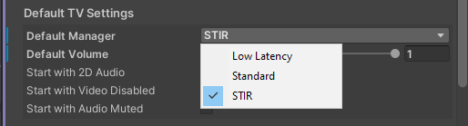

> [!NOTE]
> the latest versions of the preset UnityPackages can be found [here](https://github.com/minteeaa/stir/tree/master/meta/packages)

### overview
using the preset UnityPackage for ProTV is straightforward:

- locate the prefab in `/Assets/mintea/STIR/ProTV`.
- drag the STIR prefab into the base hierarchy of the ProTV prefab.

STIR should now be available as a ProTV preset mode, selectable from both the hierarchy and from the in-game UI.

relocate the speakers, experiment and find a setup that works for you!

### defaults
the preset audio sources can be changed to accomodate any setup. by default, the intended channel configuration for this preset is:

| OBS channel | response          | AVPro mode   |
|-------------|-------------------|--------------|
| 1           | `left [mono]`     | `Mono Left`  |
| 2           | `right [mono]`    | `Mono Right` |
| 3           | `mids (bandpass)` | `Three`      |
| 4           | `unused`          | `Four`       |
| 5           | `lowpass`         | `Five`       |
| 6           | `highpass`        | `Six`        |

`bandpass` is a mixture of `lowpass` and `highpass` filters to isolate a range of frequencies.