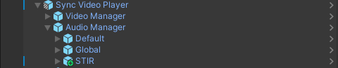
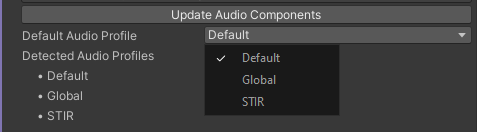
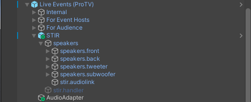
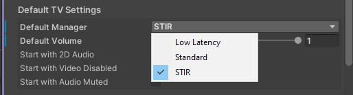

> [!NOTE]
> the latest versions of the preset UnityPackages can be found [here](https://codeberg.org/mintea/stir/src/branch/master/meta/packages)

### VideoTXL
- locate the prefab in `/Assets/mintea/STIR/VideoTXL`.
- drag the STIR prefab into the `Audio Manager` component in the TXL video player prefab.

make sure to use the `Update Audio Components` button in the Audio Manager to fully register the preset.
STIR should now be available as a VideoTXL preset mode, selectable from both the hierarchy and from the in-game UI.

### ProTV
- locate the prefab in `/Assets/mintea/STIR/ProTV`.
- drag the STIR prefab into the base hierarchy of the ProTV prefab.

STIR should now be available as a ProTV preset mode, selectable from both the hierarchy and from the in-game UI.

### defaults
it's recommended to relocate and modify the speaker setup to fit your space. the position and falloff settings of these speakers can have a **major** influence on how STIR's filters will be perceived within the area. the preset audio channels can also be changed to accomodate any setup. by default, the intended channel configuration for this preset is:

| OBS channel | response          | AVPro mode   |
|-------------|-------------------|--------------|
| 1           | `left [mono]`     | `Mono Left`  |
| 2           | `right [mono]`    | `Mono Right` |
| 3           | `mids (bandpass)` | `Three`      |
| 4           | `unused`          | `Four`       |
| 5           | `lowpass`         | `Five`       |
| 6           | `highpass`        | `Six`        |

`bandpass` is a mixture of `lowpass` and `highpass` filters to isolate a range of frequencies.